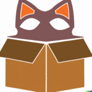

# boxedcat

> something....

 "BCAT" -> "boxedcat" (yeah?)

 # compilation
 
 ## requirements
  - nim 1.6.8+
  - nigui ( for window)
  
  unfinished since it is so experimental that it does nothing so far
  
  then run './compile.bat' in root dir
  
  shell users are smart enough to make their own commands

# Credits
## DALL-E
- for the logo
## NiGUI
- [core app UI/Frontend](https://github.com/simonkrauter/NiGui)
## SwitchBrew wiki + ReSwitched Discord
- documentation and core emulation help
